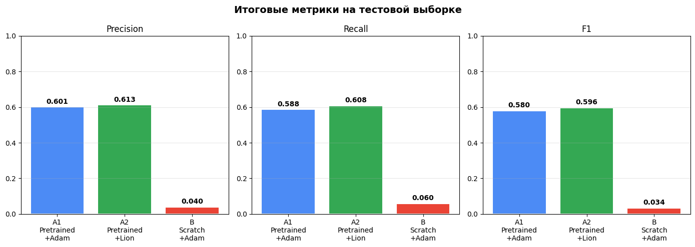
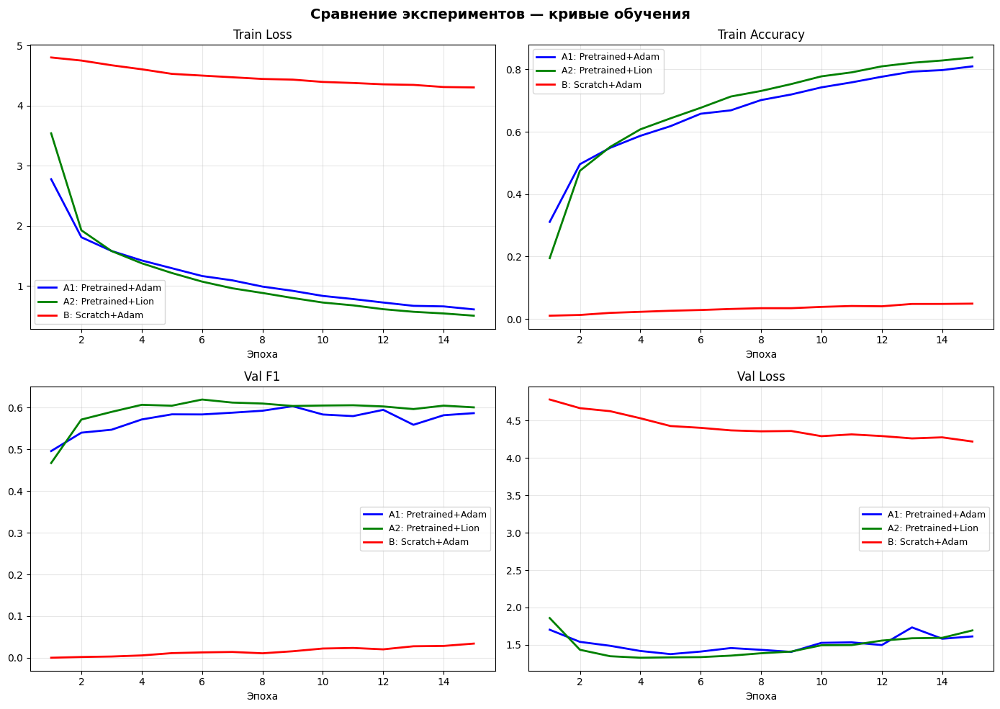

# Лабораторная работа: Классификация пород собак с помощью AlexNet
**Выполнили студенты группы 459м** Кондиляброва Вероника и Латыпов Амир

**Датасет:** Stanford Dogs Dataset (120 пород, ~20 580 изображений)  
**Архитектура:** AlexNet  
**Аугментация:** Cutout  
**Оптимизаторы:** Adam и Refined Lion  
**Фреймворк:** PyTorch + torchvision  
**Платформа:** Google Colab, GPU NVIDIA T4

---

## Содержание

1. [Постановка задачи и цель работы](#1-постановка-задачи-и-цель-работы)
2. [Теоретическая база](#2-теоретическая-база)
3. [Структура проекта](#3-структура-проекта)
4. [Разбиение данных](#4-разбиение-данных)
5. [Результаты](#5-результаты)
6. [Выводы](#6-выводы)
7. [Воспроизведение](#7-воспроизведение)
8. [Использованные источники](#8-использованные-источники)

---

## 1. Постановка задачи и цель работы

Цель лабораторной работы - освоить практическую реализацию алгоритмов глубокого обучения для задачи классификации изображений. В ходе работы необходимо:

- построить и обучить сверточную нейронную сеть архитектуры AlexNet;
- освоить методику дообучения предобученных моделей (transfer learning);
- реализовать аугментацию Cutout;
- реализовать оптимизатор Refined Lion с нуля;
- провести сравнительный анализ оптимизаторов Adam и Refined Lion;
- сравнить качество предобученной модели и модели, обученной с нуля.

**Задача:** по фотографии собаки определить породу из 120 возможных вариантов.

В рамках работы проводятся три эксперимента:

- **Эксперимент A1:** дообучение предобученной модели AlexNet с оптимизатором Adam
- **Эксперимент A2:** дообучение предобученной модели AlexNet с оптимизатором Refined Lion
- **Эксперимент B:** обучение модели AlexNet с нуля с оптимизатором Adam

---

## 2. Теоретическая база

### AlexNet

AlexNet (Krizhevsky et al., 2012) - сверточная нейронная сеть, выигравшая конкурс ImageNet LSVRC-2012 с ошибкой 15.3%, что на 10.8 п.п. лучше второго места. Эта победа дала старт эпохе глубокого обучения в компьютерном зрении.

Архитектура состоит из 5 свёрточных слоёв и 3 полносвязных:

```
Вход: 224 x 224 x 3
  Conv1(64, 11x11, stride=4) -> ReLU -> MaxPool
  Conv2(192, 5x5)            -> ReLU -> MaxPool
  Conv3(384, 3x3)            -> ReLU
  Conv4(256, 3x3)            -> ReLU
  Conv5(256, 3x3)            -> ReLU -> MaxPool
  FC(4096) -> Dropout(0.5) -> FC(4096) -> Dropout(0.5) -> FC(120)
```

Ключевые особенности: функция активации ReLU вместо sigmoid, Dropout(0.5) как регуляризатор, пересекающиеся окна MaxPooling. Всего ~61 миллион параметров, из которых 58 млн сосредоточены в полносвязных слоях.

### Transfer Learning

При дообучении берётся модель с весами, предобученными на ImageNet (1.2 млн изображений, 1000 классов). Последний слой FC(4096→1000) заменяется на FC(4096→120). Остальные веса обновляются с малым learning rate (1e-4), чтобы не разрушить уже выученные признаки.

### Аугментация Cutout

Cutout (DeVries & Taylor, 2017) — во время обучения случайный квадрат 64×64 пикселей обнуляется на изображении. Это вынуждает модель использовать весь контекст снимка, а не полагаться на одну характерную область (например, только на морду собаки).

Cutout применяется **только к train выборке** - на val и test аугментация отключается.

### Оптимизатор Adam

Adam (Kingma & Ba, 2015) поддерживает два момента для каждого параметра: первый момент (среднее градиентов) и второй момент (дисперсия градиентов). Шаг обновления адаптируется индивидуально для каждого параметра - параметры с большими нестабильными градиентами обновляются малым шагом, и наоборот. Adam хорошо работает "из коробки" и является стандартом в глубоком обучении.

Параметры в данной работе: lr=1e-4 (fine-tuning), lr=1e-3 (обучение с нуля), weight_decay=1e-4.

### Оптимизатор Refined Lion

Lion был найден методом автоматического программного поиска (AutoML). Ключевое отличие от Adam: шаг обновления определяется только **знаком** вычисленного выражения, а не его величиной. Это означает, что все параметры обновляются с одинаковым по абсолютному значению шагом, что экономит память (нет второго момента) и даёт более равномерные обновления.

Refined Lion добавляет к оригинальному Lion gradient clipping и decoupled weight decay.

Параметры в данной работе: lr=1e-5 (в 10 раз меньше Adam - стандартная рекомендация), betas=(0.9, 0.99), weight_decay=1e-4, clip_value=1.0.

### Метрики

Для оценки качества используются macro-averaged метрики - среднее по всем 120 классам без учёта их частоты:

- **Precision** = TP / (TP + FP) - доля верных предсказаний среди всех предсказаний данного класса
- **Recall** = TP / (TP + FN) - доля верно найденных объектов класса
- **F1-score** = 2 * Precision * Recall / (Precision + Recall) - сбалансированная метрика
- **Accuracy** - доля верных предсказаний по всем классам

---

## 3. Структура проекта

```
AI_LAB1/
├── stanford_dogs_alexnet.ipynb   -- весь код экспериментов
├── README.md                     --  отчёт
├── training_curves.png           -- кривые обучения
└── metrics_comparison.png        -- сравнение итоговых метрик
```

---

## 4. Разбиение данных

Данные перемешиваются с seed=42 и делятся в пропорции 70/15/15:

| Выборка | Доля | Количество | Назначение |
|---|---|---|---|
| Train | 70% | ~14 406 | Обучение модели |
| Val | 15% | ~3 087 | Подбор гиперпараметров, выбор лучшей модели |
| Test | 15% | ~3 087 | Финальная честная оценка качества |

Модель не видит test выборку до завершения обучения. Лучшая версия модели выбирается по максимальному Val F1.

---

## 5. Результаты

### Параметры обучения

| Параметр | Значение |
|---|---|
| Количество эпох | 15 |
| Размер батча | 64 |
| Входной размер | 224 x 224 |
| Cutout | 1 квадрат 64x64 (только train) |
| Время одной эпохи | ~101-104 секунды |

### Тестовые метрики

| Эксперимент | Precision | Recall | F1-score | Accuracy |
|---|---|---|---|---|
| **A1: Pretrained + Adam** | **0.6117** | **0.5972** | **0.5920** | **0.6048** |
| A2: Pretrained + Lion | 0.6038 | 0.5958 | 0.5901 | 0.6038 |
| B: Scratch + Adam | 0.0267 | 0.0515 | 0.0280 | 0.0512 |

Лучший результат показал Эксперимент A1 (Pretrained + Adam) по всем четырём метрикам.



### Adam vs Refined Lion (предобученная модель)

| Метрика | A1: Adam | A2: Lion | Разница |
|---|---|---|---|
| Precision | 0.6117 | 0.6038 | +0.0079 |
| Recall | 0.5972 | 0.5958 | +0.0014 |
| F1-score | 0.5920 | 0.5901 | +0.0019 |
| Accuracy | 0.6048 | 0.6038 | +0.0010 |

Разница минимальная — менее 0.002 по F1. Оба оптимизатора показали сопоставимые результаты при дообучении предобученной модели. С более тщательным подбором гиперпараметров Refined Lion мог бы сравняться с Adam или превзойти его.

### Динамика обучения

#### Эксперимент A1: Pretrained + Adam

| Эпоха | Train Loss | Train Acc | Val F1 |
|---|---|---|---|
| 1 | 2.7784 | 0.309 | 0.4933 |
| 4 | 1.4286 | 0.582 | 0.5759 |
| 8 | 0.9904 | 0.702 | 0.6018 |
| 12 | 0.7238 | 0.778 | **0.6036** |
| 15 | 0.6125 | 0.813 | 0.5780 |

#### Эксперимент A2: Pretrained + Refined Lion

| Эпоха | Train Loss | Train Acc | Val F1 |
|---|---|---|---|
| 1 | 3.5602 | 0.197 | 0.4633 |
| 4 | 1.3748 | 0.600 | 0.6002 |
| 5 | 1.2167 | 0.644 | **0.6217** |
| 8 | 0.8842 | 0.727 | 0.6090 |
| 15 | 0.5255 | 0.836 | 0.5930 |

#### Эксперимент B: AlexNet с нуля + Adam

| Эпоха | Train Loss | Train Acc | Val F1 |
|---|---|---|---|
| 1 | 4.7988 | 0.011 | 0.0002 |
| 5 | 4.6151 | 0.023 | 0.0084 |
| 10 | 4.4502 | 0.038 | 0.0150 |
| 15 | 4.3799 | 0.044 | 0.0240 |

### Кривые обучения



Наблюдения по графикам:

- Adam и Refined Lion имеют похожие траектории Train Loss, однако Lion стартует медленнее (эпоха 1: Train Acc 0.197 против 0.309 у Adam).
- Refined Lion достиг лучшего Val F1 = 0.6217 уже на эпохе 5, тогда как у Adam пик — Val F1 = 0.6036 на эпохе 12. Это говорит о том, что Lion сходится быстрее, но сильнее переобучается после пика.
- У обоих предобученных экспериментов заметно переобучение: Train Acc продолжает расти до 81–84%, тогда как Val F1 стабилизируется или снижается после 8–12 эпохи.
- Модель с нуля за 15 эпох практически не обучилась: Train Acc достигла лишь 4.4%, Val F1 = 0.028. Loss снижался медленно, но модель так и не начала осмысленно различать породы.

---

## 6. Выводы

**Transfer Learning значительно превосходит обучение с нуля.** Предобученная модель достигла F1 = 0.592 за 15 эпох, тогда как модель с нуля - F1 = 0.028. Разрыв более чем в 21 раз. Предобученные веса ImageNet уже содержат универсальные визуальные признаки - края, текстуры, формы, части объектов - которые напрямую применимы к задаче распознавания пород. Обучение с нуля на 14 000 изображениях нецелесообразно: для сравнимого результата потребовалось бы минимум 100–150 эпох с дополнительными техниками регуляризации.

**Adam и Refined Lion показали практически одинаковые результаты при дообучении.** Разрыв по F1 составил 0.0019 в пользу Adam. При этом Refined Lion сходится быстрее и достигает лучшего Val F1 = 0.6217 уже на эпохе 5 против Val F1 = 0.6036 у Adam на эпохе 12. Если применить early stopping, Refined Lion потенциально дал бы лучший результат. С более тщательным подбором learning rate и beta-параметров Lion может сравняться с Adam или превзойти его.

**Переобучение - ключевая проблема AlexNet на данном датасете.** AlexNet не имеет Batch Normalization, а 58 из 61 млн параметров сосредоточены в полносвязных слоях, что делает архитектуру склонной к переобучению. Для улучшения рекомендуется: learning rate scheduler (ReduceLROnPlateau или cosine annealing), early stopping, более агрессивная аугментация.

---

## 7. Воспроизведение

Обучение проводилось на Google Colab с GPU T4. Все три эксперимента находятся в одном notebook.

1. Открыть `stanford_dogs_alexnet.ipynb` в Google Colab
2. Включить GPU: Среда выполнения -> Сменить среду выполнения -> T4 GPU
3. Запустить все ячейки последовательно (Среда выполнения -> Выполнить все)

Зависимости:

```
torch>=2.0
torchvision>=0.15
scikit-learn>=1.3
scipy>=1.10
matplotlib>=3.7
pandas>=2.0
```

---

## 8. Использованные источники

1. Krizhevsky A., Sutskever I., Hinton G. E. ImageNet Classification with Deep Convolutional Neural Networks // Advances in Neural Information Processing Systems. — 2012. — Vol. 25. — URL: https://papers.nips.cc/paper/2012/hash/c399862d3b9d6b76c8436e924a68c45b-Abstract.html

2. Khosla A., Jayadevaprakash N., Yao B., Fei-Fei L. Novel Dataset for Fine-Grained Image Categorization // First Workshop on Fine-Grained Visual Categorization, CVPR. — 2011. — URL: http://vision.stanford.edu/aditya86/ImageNetDogs/

3. DeVries T., Taylor G. W. Improved Regularization of Convolutional Neural Networks with Cutout // arXiv:1708.04552. — 2017. — URL: https://arxiv.org/abs/1708.04552

4. Kingma D. P., Ba J. Adam: A Method for Stochastic Optimization // ICLR. — 2015. — URL: https://arxiv.org/abs/1412.6980

5. Chen X., Liang C., Huang D. et al. Symbolic Discovery of Optimization Algorithms (Lion) // arXiv:2302.06675. — 2023. — URL: https://arxiv.org/abs/2302.06675

6. Yosinski J., Clune J., Bengio Y., Lipson H. How Transferable are Features in Deep Neural Networks? // NeurIPS. — 2014. — URL: https://arxiv.org/abs/1411.1792

7. Srivastava N., Hinton G. et al. Dropout: A Simple Way to Prevent Neural Networks from Overfitting // JMLR. — 2014. — Vol. 15. — URL: https://jmlr.org/papers/v15/srivastava14a.html

8. PyTorch Documentation. torchvision.models.alexnet. — URL: https://pytorch.org/vision/stable/models/alexnet.html
