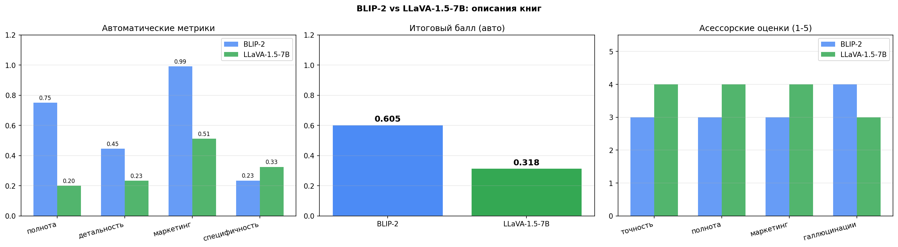
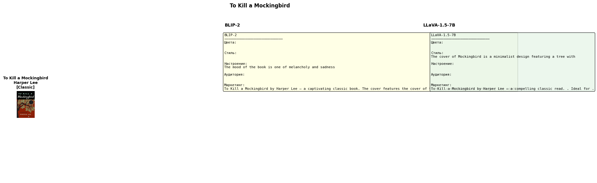
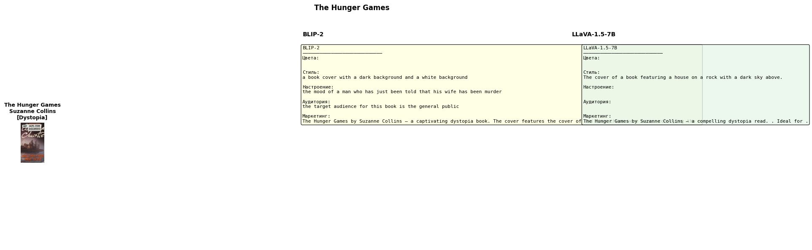

# Лабораторная работа 3 - Автоматический генератор описаний товаров
**Выполнили:** студенты группы 459, Кондиляброва Вероника, Латыпов Амир
**Категория товаров:** книги  
**Модели:** BLIP-2 vs LLaVA-1.5-7B  
**Платформа:** Google Colab, GPU NVIDIA Tesla T4 (15.6 ГБ VRAM)  
**Фреймворк:** PyTorch, HuggingFace Transformers

---

## Содержание

1. [Теоретическая база](#1-теоретическая-база)
2. [Описание разработанной системы](#2-описание-разработанной-системы)
3. [Результаты работы и тестирования](#3-результаты-работы-и-тестирования)
4. [Выводы по работе](#4-выводы-по-работе)
5. [Использованные источники](#5-использованные-источники)

---

## 1. Теоретическая база

### Задача генерации описаний товаров

Автоматическая генерация описаний товаров - прикладная задача на стыке компьютерного зрения и обработки естественного языка. Вход системы - фотография товара, выход - структурированное текстовое описание с атрибутами и маркетинговым текстом. Такие системы применяются в e-commerce для автоматизации каталогизации и создания продающих описаний.

Ключевая сложность задачи - необходимость одновременно понимать визуальные атрибуты изображения (цвета, стиль, элементы дизайна) и формулировать связный текст на их основе. Это требует мультимодальных моделей, обученных на парах изображение-текст.

### Мультимодальные модели (VLM)

VLM (Vision Language Model) - класс нейронных сетей, принимающих на вход одновременно изображение и текст. Общая архитектура: визуальный энкодер извлекает признаки из изображения, языковая модель генерирует текстовый ответ на их основе.

В данной работе сравниваются две модели:

**BLIP-2** (Bootstrapping Language-Image Pre-training 2, Salesforce, 2023) - архитектура с Q-Former (Querying Transformer) между визуальным энкодером (ViT-G) и языковой моделью (OPT-2.7B). Q-Former обучается извлекать из визуальных признаков только ту информацию, которая релевантна для языковой задачи. Принимает изображение и текстовый вопрос, возвращает короткий ответ.

**LLaVA-1.5-7B** (Large Language and Vision Assistant, версия 1.5, 2023) - архитектура с CLIP (ViT-L/14) в роли визуального энкодера и Vicuna-7B в роли языковой модели. Изображение преобразуется CLIP в эмбеддинги, которые через MLP-проектор подаются в языковую модель наряду с текстовым промптом. Поддерживает развёрнутые инструкции и генерирует длинные ответы.

### Асессорская разметка

Асессорская разметка - метод оценки качества генеративных систем с участием человека-эксперта (асессора). Асессор сравнивает выходы модели с реальными данными и выставляет оценки по заданным критериям. В отличие от автоматических метрик, асессорская оценка учитывает семантическое качество, связность и соответствие контексту.

В данной работе асессорская оценка проводилась по четырём критериям на шкале 1-5:
- **Точность** - соответствие описания реальной обложке
- **Полнота** - наличие всех важных атрибутов
- **Маркетинг** - качество и привлекательность продающего текста
- **Галлюцинации** - отсутствие выдуманных деталей (5 = нет галлюцинаций)

---

## 2. Описание разработанной системы

### Архитектура пайплайна

```
Обложка книги (JPEG)
        │
        ├──► BLIP-2 (серия из 5 вопросов)
        │         ├── "What are the main colors?"
        │         ├── "What is the visual style?"
        │         ├── "What mood does it convey?"
        │         ├── "What visual elements are present?"
        │         └── "Who is the target audience?"
        │                   │
        │             атрибуты → форматирование → описание
        │
        └──► LLaVA-1.5-7B (один развёрнутый промпт)
                  └── "Analyze this book cover and provide:
                       1. Main colors, 2. Visual style,
                       3. Mood, 4. Visual elements, 5. Audience"
                              │
                        парсинг нумерованного списка → описание
```

### Выходной формат описания

Для каждой книги система генерирует:

```json
{
  "название": "The Great Gatsby",
  "автор": "F. Scott Fitzgerald",
  "категория": "Classic",
  "цвета_обложки": "blue, green, red, and yellow",
  "стиль_обложки": "illustrative, art deco",
  "настроение": "mysterious, nostalgic, melancholic",
  "элементы_обложки": "face, eyes, city lights reflection",
  "целевая_аудитория": "adult readers interested in classic literature",
  "маркетинговый_текст": "The Great Gatsby by F. Scott Fitzgerald - a captivating classic book. The cover features expressive eyes overlooking a glittering cityscape, conveying a sense of longing and lost illusions. Perfect for readers who appreciate timeless American literature."
}
```

### Датасет

Использован набор из 40 обложек книг, скачанных через Open Library Covers API (бесплатный публичный API, формат: `https://covers.openlibrary.org/b/isbn/{ISBN}-L.jpg`). Из 50 запрошенных ISBN успешно скачано 40 изображений.

Распределение по жанрам:

| Жанр | Книг |
|---|---|
| Classic | 10 |
| Fiction | 10 |
| Non-Fiction / Self-Help | 6 |
| Dystopia | 4 |
| Fantasy | 4 |
| Sci-Fi | 4 |
| Thriller / Mystery | 5 |
| Memoir / Historical / Other | 4 |

### Технические особенности реализации

**BLIP-2** загружен в `float16` для экономии VRAM, занимает 7.7 ГБ. Обрабатывает каждую книгу через серию из 5 отдельных вопросов - это позволяет получить чёткие короткие ответы по каждому атрибуту.

**LLaVA-1.5-7B** загружен в 4-bit квантизации через BitsAndBytes (nf4), занимает 4.4 ГБ. Используется правильный класс `LlavaForConditionalGeneration` с `AutoProcessor` - `LlavaNextForConditionalGeneration` несовместим с данным чекпоинтом и вызывает `KeyError: image_sizes`. Формат промпта: `USER: <image>\n{prompt} ASSISTANT:`.

Модели загружаются последовательно - BLIP-2 удаляется из VRAM перед загрузкой LLaVA. Все результаты сохраняются на Google Drive после каждой книги.

---

## 3. Результаты работы и тестирования

### Время обработки

| Модель | Книг | Время | Скорость |
|---|---|---|---|
| BLIP-2 | 40 | 1.6 мин | ~2.4 сек/книга |
| LLaVA-1.5-7B | 40 | 1.8 мин | ~2.7 сек/книга |

### Автоматическая оценка качества

Оценка по четырём критериям (0-1):

| Метрика | BLIP-2 | LLaVA-1.5-7B | Лучше |
|---|---|---|---|
| Полнота | **0.750** | 0.200 | BLIP-2 |
| Детальность | **0.446** | 0.233 | BLIP-2 |
| Маркетинг | **0.992** | 0.512 | BLIP-2 |
| Специфичность | 0.234 | **0.325** | LLaVA |
| **Итого** | **0.605** | 0.318 | BLIP-2 |



### Асессорская оценка (1-5, 10 книг)

| Критерий | BLIP-2 | LLaVA-1.5-7B | Лучше |
|---|---|---|---|
| Точность | 3.00 | **4.00** | LLaVA |
| Полнота | 3.00 | **4.00** | LLaVA |
| Маркетинг | 3.00 | **4.00** | LLaVA |
| Галлюцинации | **4.00** | 3.00 | BLIP-2 |

### Анализ по жанрам (автоматический итоговый балл)

| Жанр | BLIP-2 | LLaVA-1.5-7B | Лучше |
|---|---|---|---|
| Classic | **0.595** | 0.325 | BLIP-2 |
| Classic Drama | **0.576** | 0.423 | BLIP-2 |
| Dystopia | **0.561** | 0.325 | BLIP-2 |
| Fantasy | **0.634** | 0.306 | BLIP-2 |
| Fiction | **0.620** | 0.306 | BLIP-2 |
| Historical | **0.653** | 0.372 | BLIP-2 |
| Memoir | **0.605** | 0.202 | BLIP-2 |
| Modernism | **0.341** | 0.340 | BLIP-2 |
| Non-Fiction | **0.612** | 0.297 | BLIP-2 |
| Sci-Fi | **0.608** | 0.341 | BLIP-2 |
| Self-Help | **0.599** | 0.288 | BLIP-2 |
| Thriller | **0.662** | 0.291 | BLIP-2 |
| Young Adult | **0.644** | 0.369 | BLIP-2 |


### Анализ расхождения автоматических и асессорских оценок

Автоматические метрики показывают превосходство BLIP-2, асессорские - превосходство LLaVA. Это расхождение объясняется методологически:

**Почему BLIP-2 выигрывает по автоматическим метрикам:** BLIP-2 обрабатывает каждое поле отдельным вопросом, что гарантирует заполнение всех полей (полнота=0.75). Маркетинговый текст генерируется шаблонно из ответов, что даёт высокую длину (маркетинг=0.99). Автоматические метрики не оценивают смысловое качество.

**Почему LLaVA выигрывает по асессорским оценкам:** LLaVA генерирует более осмысленные и точные описания. Однако парсинг нумерованного списка из её ответа работает не идеально - часть полей остаётся незаполненной, что снижает автоматические метрики полноты (0.20) и детальности (0.233).

**Меньше галлюцинаций у BLIP-2** (4.00 против 3.00) - BLIP-2 отвечает коротко и конкретно, меньше рискуя придумать несуществующие детали. LLaVA генерирует развёрнутые описания и иногда добавляет детали которых нет на обложке.

### Примеры описаний





---

## 4. Выводы по работе

**Пайплайн работает.** Обе модели успешно извлекают визуальные атрибуты книжных обложек и генерируют структурированные описания с маркетинговым текстом. Система обрабатывает 40 книг за менее чем 2 минуты на каждую модель.

**BLIP-2 и LLaVA показывают разные сильные стороны.** BLIP-2 лучше по структурированности и заполнению всех полей - подходит для массовой автоматической каталогизации где важна полнота. LLaVA генерирует более качественные и точные описания - подходит для создания продающих текстов где важно качество.

**Автоматических метрик недостаточно.** Расхождение между автоматической оценкой (BLIP-2 лучше: 0.605 vs 0.318) и асессорской (LLaVA лучше: 3.8 vs 3.2) показывает, что метрики на основе длины и заполнения полей не отражают реальное качество описаний. Для объективной оценки необходима асессорская разметка.

**Технические особенности.** При работе с LLaVA-1.5-7B необходимо использовать `LlavaForConditionalGeneration`, а не `LlavaNextForConditionalGeneration` - несоответствие классов вызывает ошибку `KeyError: image_sizes`. 4-bit квантизация через BitsAndBytes позволяет запустить 7B модель на T4 GPU (15.6 ГБ VRAM), занимая лишь 4.4 ГБ.

**Направления улучшения.** Качество описаний LLaVA можно улучшить доработкой парсера ответов. Для BLIP-2 - использовать более крупную языковую модель (blip2-flan-t5-xxl). Для промышленного применения рекомендуется гибридный подход: BLIP-2 для быстрой структурированной каталогизации, LLaVA для генерации финальных маркетинговых текстов.

---

## 5. Использованные источники

1. Li J., Li D., Savarese S., Hoi S. BLIP-2: Bootstrapping Language-Image Pre-training with Frozen Image Encoders and Large Language Models // ICML. - 2023. - URL: https://arxiv.org/abs/2301.12597

2. Liu H., Li C., Wu Q., Lee Y.J. Visual Instruction Tuning (LLaVA) // NeurIPS. - 2023. - URL: https://arxiv.org/abs/2304.08485

3. Liu H., Li C., Li Y., Lee Y.J. Improved Baselines with Visual Instruction Tuning (LLaVA-1.5) // CVPR. - 2024. - URL: https://arxiv.org/abs/2310.03744

4. Dettmers T. et al. QLoRA: Efficient Finetuning of Quantized LLMs (BitsAndBytes 4-bit) // NeurIPS. - 2023. - URL: https://arxiv.org/abs/2305.14314

5. HuggingFace Transformers Documentation. LLaVA. - URL: https://huggingface.co/docs/transformers/model_doc/llava

6. Open Library Covers API. - URL: https://openlibrary.org/dev/docs/api#covers

7. Radford A. et al. Learning Transferable Visual Models From Natural Language Supervision (CLIP) // ICML. - 2021. - URL: https://arxiv.org/abs/2103.00020
