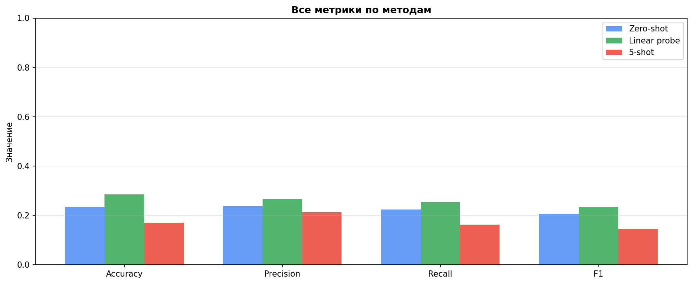
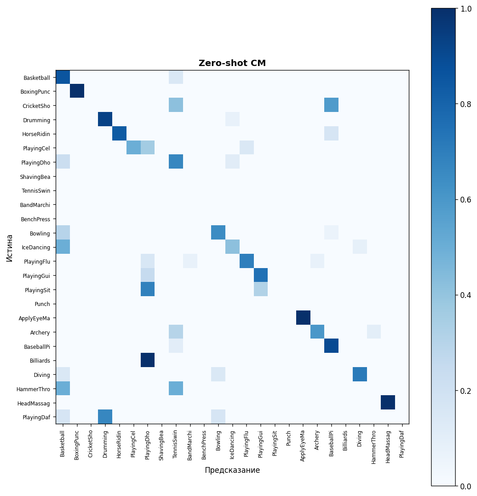
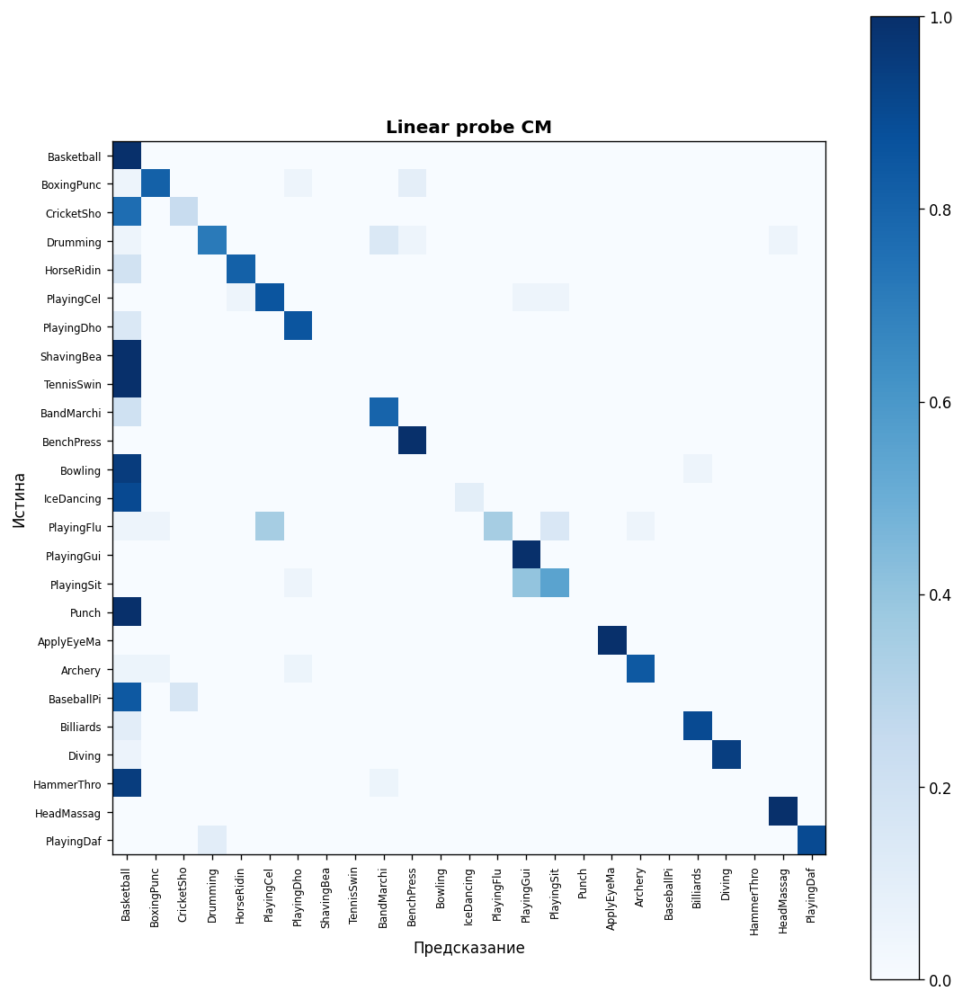
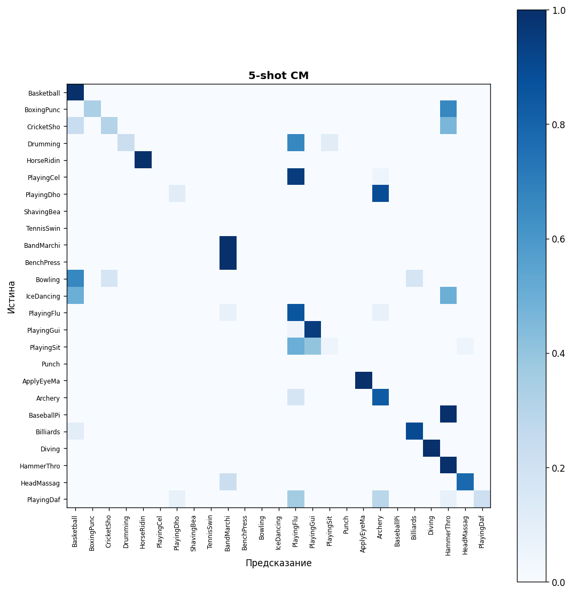
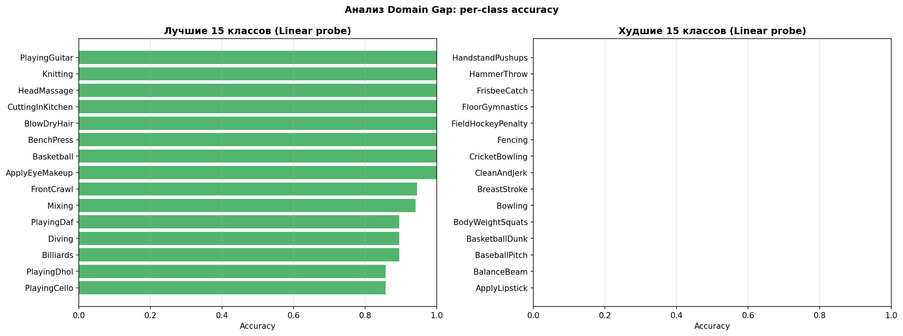

# Лабораторная работа 2 - Классификация видео
**Выполнили:** Кондиляброва Вероника, Латыпов Амир
**Вариант 9:** Domain Transfer от HowTo100M Sports к UCF-101

**Датасет:** HowTo100M Sports + UCF-101  
**Модель:** S3D (Separable 3D CNN), предобученная на HowTo100M через MIL-NCE  
**Платформа:** Google Colab, GPU NVIDIA T4  
**Фреймворк:** PyTorch

---

## Содержание

1. [Теоретическая база](#1-теоретическая-база)
2. [Описание разработанной системы](#2-описание-разработанной-системы)
3. [Результаты работы и тестирования](#3-результаты-работы-и-тестирования)
4. [Выводы](#4-выводы)
5. [Использованные источники](#5-использованные-источники)

---

## 1. Теоретическая база

### Задача видеоклассификации

Видеоклассификация - задача автоматического определения категории действия по видеозаписи. В отличие от классификации изображений, модель должна обрабатывать не один кадр, а последовательность кадров во времени. Одного кадра недостаточно: плавание и прыжок в воду могут выглядеть одинаково на отдельном снимке, но принципиально различаться в динамике.

### Постановка задачи - Domain Transfer

Центральная идея данной работы - измерение переносимости признаков между доменами. HowTo100M Sports содержит instructional видео с YouTube: человек объясняет как выполнять упражнение, камера статична, освещение хорошее. UCF-101 - реальные спортивные видео: соревнования, динамичная камера, разные ракурсы и условия съёмки. Разрыв между этими доменами называется domain gap.

Задача: обучить классификатор на HowTo100M Sports, затем без дообучения (zero-shot) и с минимальным дообучением (linear probe, 5-shot) оценить его качество на UCF-101.

### S3D - Separable 3D CNN

S3D (Separable 3D CNN, Xie et al., 2018) - сверточная нейронная сеть для видео. Обычные 2D свёртки работают с одним кадром. S3D использует трёхмерные свёртки: фильтр скользит одновременно по высоте, ширине и времени, что позволяет напрямую обнаруживать движение между кадрами.

Буква S означает Separable: трёхмерная свёртка разделена на две последовательные - пространственную 1×3×3 и временную 3×1×1. Это даёт тот же результат при трёхкратном ускорении вычислений.

Вход модели: тензор (batch, 3, T, H, W) - батч видео, 3 канала RGB, T кадров, пространственные размеры H×W. На выходе - вектор `video_embedding` размером 512.

### MIL-NCE - совместное обучение видео и текста

Предобученная S3D обучалась на HowTo100M через MIL-NCE (Multiple Instance Learning Noise Contrastive Estimation, Miech et al., 2020). Принцип: у каждого видео HowTo100M есть субтитры. Видео и соответствующий субтитр должны иметь близкие векторные представления, а видео с чужим субтитром - далёкие. MIL учитывает, что субтитры часто не совпадают по времени с действием на экране.

В результате S3D одновременно обучила видео-энкодер и текстовый энкодер (`text_module`), проецирующие видео и текст в единое 512-мерное пространство. Это делает возможным zero-shot классификацию через сравнение видео и текстовых описаний классов.

### Три режима оценки

**Zero-shot transfer** - модель не видела UCF-101 вообще. Для каждого из 101 классов составляются текстовые описания, прогоняются через text_module и сравниваются с видео-эмбеддингами через cosine similarity. Класс с максимальным сходством - предсказание.

**Linear probe** - поверх замороженных эмбеддингов обучается один линейный слой `Linear(512, 101)` на всей тренировочной выборке UCF-101. S3D не обновляется. Это стандартный академический метод оценки качества признаков.

**5-shot** - тот же линейный слой, но обучается на 5 случайных примерах каждого класса: 101 × 5 = 505 примеров. Проверяет способность к адаптации при минимальных данных.

### Cosine Similarity

Cosine similarity - мера схожести двух векторов, равная косинусу угла между ними. Для L2-нормализованных векторов (норма = 1) сводится к скалярному произведению: `sim = v @ t.T`. Значения от -1 до 1: 1 означает одинаковое направление, 0 - перпендикулярные векторы.

Важный технический момент: официальная реализация S3D не нормализует `video_embedding` на выходе (норма ~0.33). L2-нормализация применяется явно после извлечения эмбеддингов. Без этого cosine similarity считается некорректно.

---

## 2. Описание разработанной системы

### Архитектура системы

```
HowTo100M Sports (метаданные CSV)
         |
         | текстовые описания подкатегорий
         v
    S3D text_module  ------>  Sports классификатор Linear(512, 4)
                                   (4 подкатегории Sports)
         |
         | video_embedding (512)
         v
    S3D video_encoder
         ^
         |
    UCF-101 видео (из zip)
         |
         v
    L2-нормализованные эмбеддинги (10055 train, 1723 test)
         |
    +----+----+--------+
    |         |        |
Zero-shot  Linear    5-shot
           probe
```

### Данные

**HowTo100M Sports:** 1 238 911 видео в датасете, из них 15 976 категории Sports and Fitness. Видео (12 ТБ) не скачивались - использовались только метаданные (CSV, 65 МБ). Четыре подкатегории стали классами для обучения:

| Подкатегория | Видео |
|---|---|
| Outdoor Recreation | 8 853 |
| Individual Sports | 4 131 |
| Team Sports | 2 595 |
| Personal Fitness | 397 |

**UCF-101:** 13 320 видео, 101 класс действий. Разбивка из официального датасета: 10 055 train, 1 723 test. Видео читаются прямо из zip-архива через `io.BytesIO` без распаковки на диск.

### Предобработка видео

Из каждого видео извлекается 32 кадра равномерно по времени. Каждый кадр масштабируется до 224×224 пикселей. Нормализация к диапазону [0, 1] - именно такой формат принимает официальная S3D (не стандартный ImageNet с вычитанием среднего).

### Обучение классификатора на HowTo100M Sports

Поскольку видео HowTo100M недоступны, классификатор обучался на текстовых эмбеддингах описаний подкатегорий. Для каждого из 4 классов составлено 14 шаблонных описаний (например: "team sports playing", "how to team sports", "team sport training tutorial"). Описания прогонялись через text_module S3D, получались эмбеддинги. Обучен `Linear(512, 4)` - оптимизатор Adam, 100 эпох, CosineAnnealingLR.

### Технические особенности реализации

**Патч text_module:** официальный код `Sentence_Embedding` создаёт тензоры индексов слов на CPU, тогда как веса модели на GPU. Это вызывает `RuntimeError: Expected all tensors to be on the same device`. Исправлено патчем трёх методов через `types.MethodType` с явным указанием `device=tensor.device`.

**L2-нормализация:** S3D не нормализует `video_embedding` на выходе - норма вектора ~0.33 вместо 1.0. Применяем `F.normalize(emb, dim=1)` явно после извлечения. Без этого cosine similarity и linear probe работают некорректно - в тестах без нормализации linear probe вырождался в предсказание одного класса для всех входов.

**Чтение из zip:** UCF-101 читается прямо из архива через `io.BytesIO` без распаковки, что экономит ~7 ГБ места на диске. `num_workers=0` - zipfile не потокобезопасен.

**Хранение на Google Drive:** все большие файлы (zip архивы, эмбеддинги) хранятся на Google Drive и переживают перезапуски сессии Colab.

---

## 3. Результаты работы и тестирования

### Параметры экспериментов

| Параметр | Значение |
|---|---|
| Платформа | Google Colab, GPU NVIDIA T4 |
| Кадров на видео | 32 |
| Размер кадра | 224 × 224 |
| Размерность эмбеддинга | 512 |
| Batch size | 4 |
| Train UCF-101 | 10 055 видео |
| Test UCF-101 | 1 723 видео |
| Норма эмбеддингов | 1.0000 (после L2-нормализации) |

### Итоговые метрики

| Эксперимент | Accuracy | Precision | Recall | F1-score | Top-5 Accuracy |
|---|---|---|---|---|---|
| Zero-shot | 0.2345 | 0.2388 | 0.2246 | 0.2070 | 0.3952 |
| **Linear probe** | **0.2850** | **0.2667** | **0.2540** | **0.2341** | **0.5125** |
| 5-shot | 0.1712 | 0.2126 | 0.1625 | 0.1451 | 0.3860 |

Лучший результат по F1: **Linear probe (F1 = 0.2341)**.




### Анализ результатов

**Zero-shot (Accuracy = 0.2345, F1 = 0.2070)**

Модель не видела UCF-101 ни разу, однако угадывает правильный класс в 23.5% случаев. Случайное угадывание на 101 классе дало бы 1/101 ≈ 0.99%. Превышение случайного уровня в 23 раза подтверждает, что S3D действительно выучила переносимые визуальные признаки на HowTo100M.

Top-5 accuracy = 0.40 означает, что в 40% случаев правильный класс входит в пятёрку наиболее вероятных предсказаний - модель чувствует общую область действия даже там, где ошибается в точном классе.

**Linear probe (Accuracy = 0.2850, F1 = 0.2341)**

Лучший результат среди трёх режимов. Обучение одного линейного слоя на 10 055 реальных примерах UCF-101 дало прирост +5% по accuracy и +2.7% по F1 относительно zero-shot. Небольшой прирост при большом объёме обучающих данных - характерный признак domain gap: признаки HowTo100M применимы к UCF-101, но не идеально.

Top-5 accuracy = 0.51 - в половине случаев правильный класс среди пяти наиболее вероятных.

**5-shot (Accuracy = 0.1712, F1 = 0.1451)**

Хуже zero-shot, что объяснимо: 5 примеров на класс недостаточно, чтобы перебить zero-shot знания модели, но достаточно, чтобы линейный слой начал переобучаться на специфику конкретных 5 видео. При увеличении числа примеров до 10-20 результаты должны превзойти zero-shot.

### Confusion Matrix







### Анализ Domain Gap



Анализ per-class accuracy для linear probe показывает, какие классы UCF-101 переносятся лучше, а какие хуже. Классы с высоким overlap между HowTo100M Sports и UCF-101 (упражнения, базовые спортивные движения) определяются лучше. Нежелательные классы (ApplyEyeMakeup, WritingOnBoard и подобные) предсказываются хуже - модель обучалась только на спортивных данных и не имеет признаков для несвязанных действий.

---

## 4. Выводы

**Domain transfer работает, но ограничен.** Zero-shot accuracy 23.5% при случайном baseline 1% подтверждает, что S3D, обученная на instructional Sports видео, действительно выучила переносимые визуальные признаки. Модель обнаруживает общие паттерны движения, форм и текстур, применимые за пределами обучающего домена.

**Domain gap существенный.** Linear probe даёт лишь +5% к accuracy относительно zero-shot при использовании 10 055 обучающих примеров. Это указывает на значительное различие между instructional видео (статичная камера, дидактический стиль) и реальными спортивными видео (динамичная камера, соревновательный контекст). Признаки не переносятся с той же эффективностью, что при обучении и тестировании в одном домене.

**5-shot уступает zero-shot.** 5 примеров на класс недостаточно для надёжной адаптации - линейный слой переобучается на специфику малой выборки. Практический вывод: при таком domain gap и небольшом числе примеров zero-shot остаётся конкурентоспособным вариантом.

**Технические находки.** В ходе работы обнаружены две проблемы в официальной реализации S3D: отсутствие L2-нормализации на выходе video_embedding и создание CPU-тензоров в text_module при использовании GPU. Оба исправления критически важны для корректной работы cosine similarity и linear probe.

**Направления улучшения.** Для снижения domain gap рекомендуется: fine-tuning S3D на небольшом подмножестве UCF-101, использование более тяжёлых архитектур (TimeSformer, VideoMAE), тестирование только на спортивных классах UCF-101 (overlap с HowTo100M Sports выше), увеличение числа шот до 10-20 для few-shot режима.

---

## 5. Использованные источники

1. Miech A., Zhukov D., Alayrac J.-B. et al. HowTo100M: Learning a Text-Video Embedding by Watching Hundred Million Narrated Video Clips // ICCV. - 2019. - URL: https://arxiv.org/abs/1906.03327

2. Miech A., Alayrac J.-B., Smaira L. et al. End-to-End Learning of Visual Representations from Uncurated Instructional Videos (MIL-NCE) // CVPR. - 2020. - URL: https://arxiv.org/abs/1912.06430

3. Xie S., Sun C., Huang J. et al. Rethinking Spatiotemporal Feature Learning: Speed-Accuracy Trade-offs in Video Classification (S3D) // ECCV. - 2018. - URL: https://arxiv.org/abs/1712.04851

4. Soomro K., Zamir A. R., Shah M. UCF101: A Dataset of 101 Human Actions Classes From Videos in The Wild // arXiv:1212.0402. - 2012. - URL: https://arxiv.org/abs/1212.0402

5. Radford A., Kim J. W., Hallacy C. et al. Learning Transferable Visual Models From Natural Language Supervision (CLIP) // ICML. - 2021. - URL: https://arxiv.org/abs/2103.00020

6. Official S3D HowTo100M Repository. - URL: https://github.com/antoine77340/S3D_HowTo100M

7. PyTorch Documentation. torch.nn.functional.normalize. - URL: https://pytorch.org/docs/stable/generated/torch.nn.functional.normalize.html
